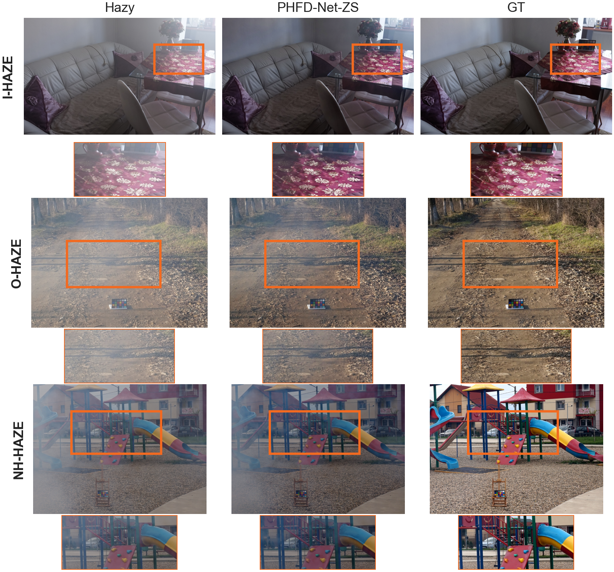
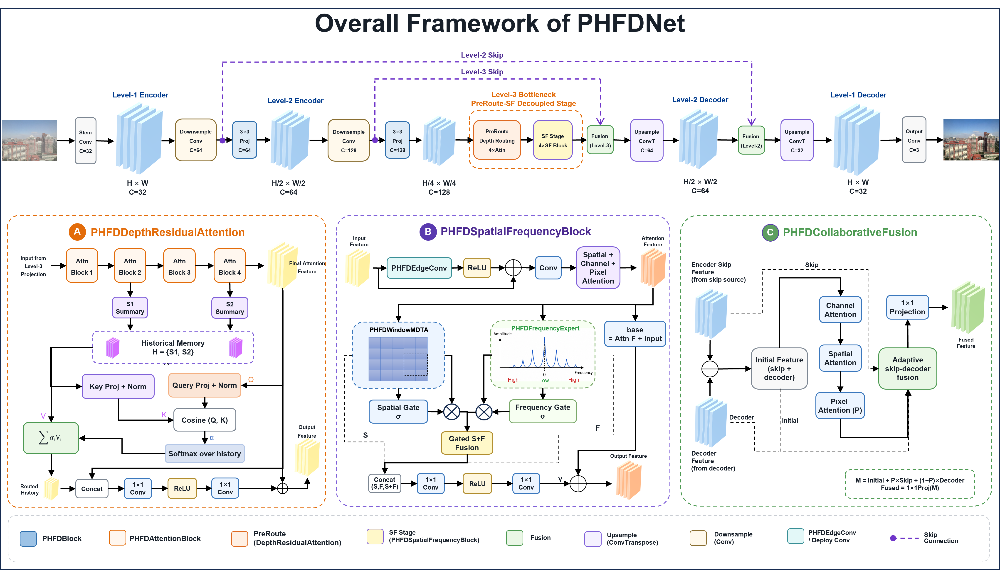
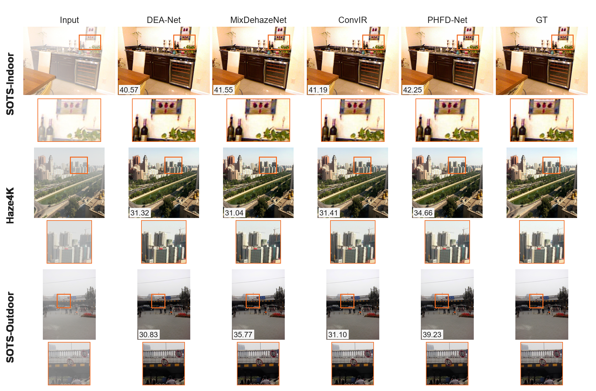

# PHFD-Net: A Locally Re-parameterized Hierarchical Spatial-Frequency Network for Single Image Dehazing

This repository is the official project page for PHFD-Net.
The paper is currently under review.
Source code, training scripts, pretrained models, and checkpoints will be released upon publication.

## Overview

PHFD-Net is designed for single image dehazing with a hierarchical restoration
pipeline that combines local detail-enhanced restoration, deep-state residual
routing, and spatial-frequency bottleneck refinement.

This repository is a release placeholder and project page. It is intended to
share paper-level information, experimental tables, figures, and evaluation
protocol notes before the full research artifacts are released.

## Method Highlights

- local detail-enhanced restoration;
- deep-state history residual routing;
- spatial-frequency bottleneck refinement;
- local-branch re-parameterization for deployment.

## Results

Main quantitative results are provided in
[results/quantitative_results.md](results/quantitative_results.md).
Ablation results are provided in
[results/ablation_results.md](results/ablation_results.md).
Complexity profiling is provided in
[results/complexity_profile.md](results/complexity_profile.md).

## Dataset and Evaluation Protocol

Protocol notes are available in:

- [docs/dataset_protocol.md](docs/dataset_protocol.md)
- [docs/evaluation_protocol.md](docs/evaluation_protocol.md)

The reported benchmarks include SOTS-Indoor, Haze4K, and SOTS-Outdoor. Fine-tuned
results are reported separately from matched or scratch training comparisons.

## Release Plan

The release plan is available in [docs/release_plan.md](docs/release_plan.md).

## Citation

Citation will be updated after publication.

## Contact

For questions about this project page, please contact the authors after the
paper review process is complete.
